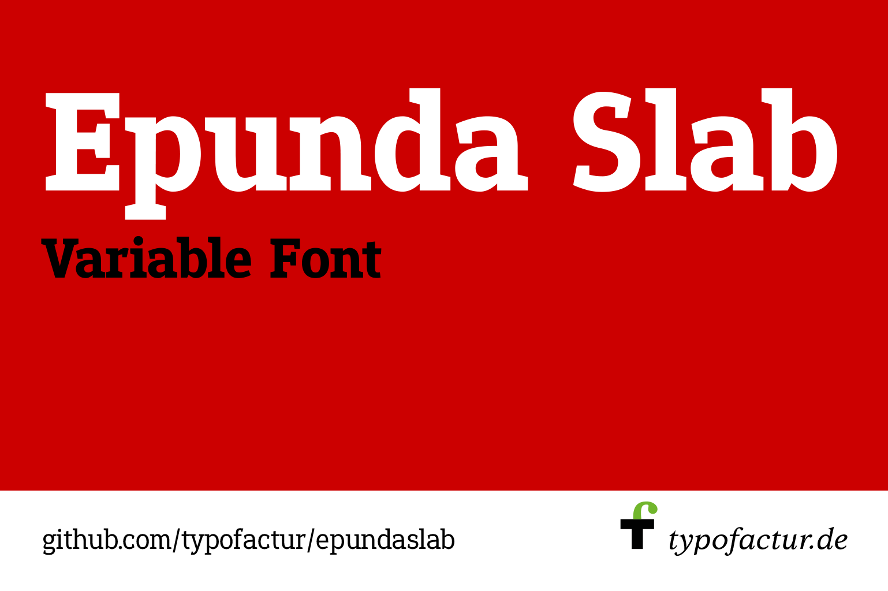
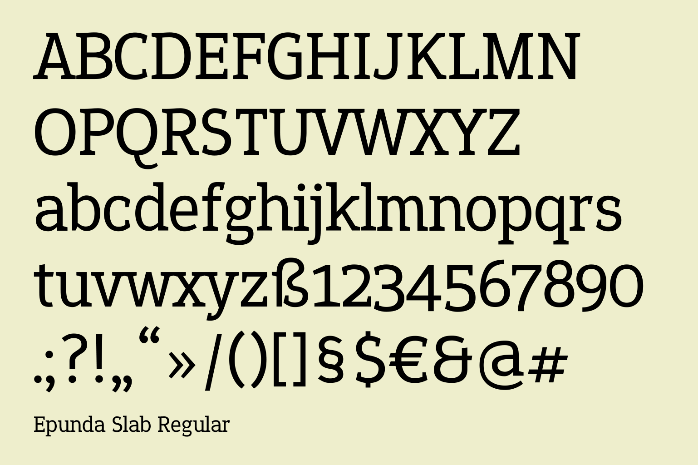
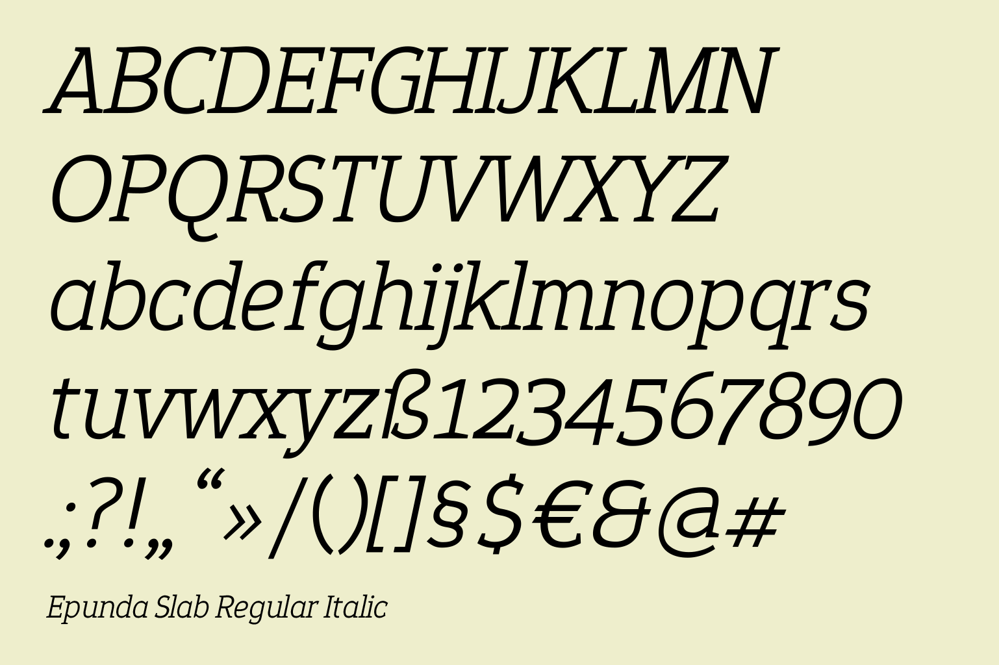
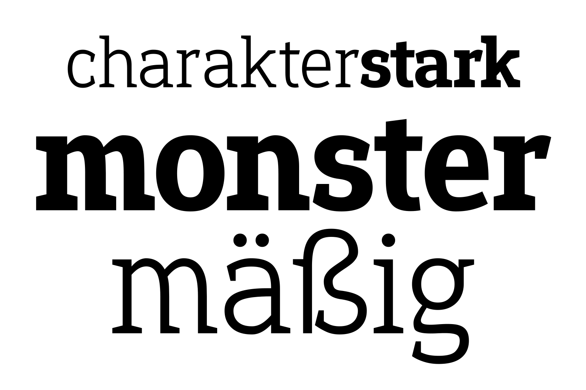
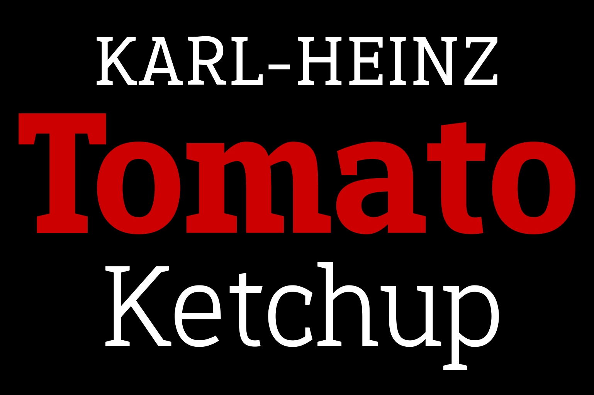
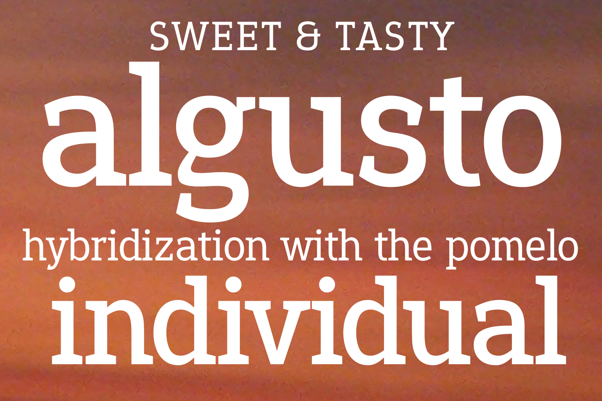
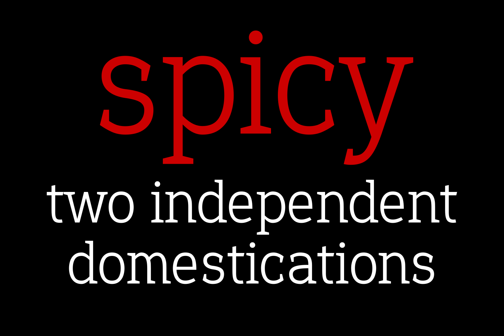

----

# Epunda Slab

[![][Fontbakery]](https://typofactur.github.io/epundaslab/fontbakery/fontbakery-report.html)
[![][Universal]](https://typofactur.github.io/epundaslab/fontbakery/fontbakery-report.html)
[![][GF Profile]](https://typofactur.github.io/epundaslab/fontbakery/fontbakery-report.html)
[![][Shaping]](https://typofactur.github.io/epundaslab/fontbakery/fontbakery-report.html)

[Fontbakery]: https://img.shields.io/endpoint?url=https%3A%2F%2Fraw.githubusercontent.com%2Ftypofactur%2Fepundaslab%2Fgh-pages%2Fbadges%2Foverall.json
[GF Profile]: https://img.shields.io/endpoint?url=https%3A%2F%2Fraw.githubusercontent.com%2Ftypofactur%2Fepundaslab%2Fgh-pages%2Fbadges%2FGoogleFonts.json
[Outline Correctness]: https://img.shields.io/endpoint?url=https%3A%2F%2Fraw.githubusercontent.com%2Ftypofactur%2Fepundaslab%2Fgh-pages%2Fbadges%2FOutlineCorrectnessChecks.json
[Shaping]: https://img.shields.io/endpoint?url=https%3A%2F%2Fraw.githubusercontent.com%2Ftypofactur%2Fepundaslab%2Fgh-pages%2Fbadges%2FShapingChecks.json
[Universal]: https://img.shields.io/endpoint?url=https%3A%2F%2Fraw.githubusercontent.com%2Ftypofactur%2Fepundaslab%2Fgh-pages%2Fbadges%2FUniversal.json

Epunda Slab is the perfect companion of Epunda Sans. The sturdy, angled serifs give the font a robust and traditional look.

Epundas Sans is a variable font with a weight axis that ranges from Light (300) to Black (900).

## About

typofactur is a German type foundry run by the graphic designer Simon Atzbach.
Find out more at https://typofactur.de

## Building

Fonts are built automatically by GitHub Actions - take a look in the "Actions" tab for the latest build.

If you want to build fonts manually on your own computer:

* `make build` will produce font files.
* `make test` will run [FontBakery](https://github.com/googlefonts/fontbakery)'s quality assurance tests.
* `make proof` will generate HTML proof files.

The proof files and QA tests are also available automatically via GitHub Actions - look at https://typofactur.github.io/epundaslab.git.

## Changelog

**25 December 2024. Version 1.002**
- initial commit
- analog to Epunda Sans
- including Italic

**31 December 2024. Version 1.100**
- kerning with kern on

**04 January 2024. Version 1.101**
- contour order colon
- width math signs
- no softhyphen
- dcroat
- serifs not exported
- path direction brackets, exclams, guillemots

## License

This Font Software is licensed under the SIL Open Font License, Version 1.1.
This license is available with a FAQ at https://openfontlicense.org

## Repository Layout

This font repository structure is inspired by [Unified Font Repository v0.3](https://github.com/unified-font-repository/Unified-Font-Repository), modified for the Google Fonts workflow.
